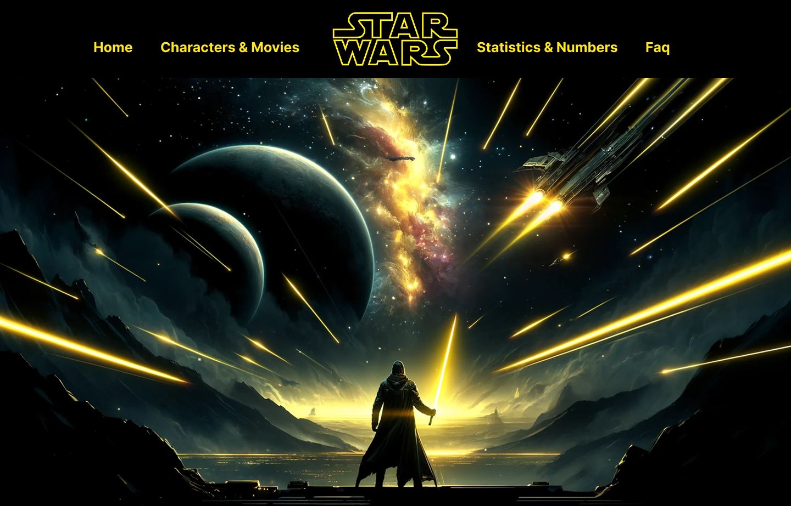

# Star Wars API Character & Movie Guide 🚀🌌

# Project Overview
This project is a responsive Star Wars character and movie guide that fetches data from the Star Wars API (SWAPI) to display a list of characters and their associated movies. The goal is to practice working with AJAX requests, Fetch API, JSON data handling, error management, and UI responsiveness while incorporating GSAP animations for enhanced user interaction.

## Features  
✅ **Dynamic Character List:** Displays an unordered list of **10+ Star Wars characters**, fetched from SWAPI.  
✅ **Interactive Movie Details:** Clicking on a character fetches and displays details about one of their movies, including:  
   - 🎬 **Movie Title**  
   - 📜 **Opening Crawl** (intro text from Star Wars films)  
   - 🖼️ **Movie Poster** (sourced separately and stored locally in the `images/` folder)  
✅ **AJAX Request Handling:** Implements **Fetch API with error handling**, ensuring smooth data retrieval.  
✅ **Loading Indicator:** Displays a **loading animation** while data is being fetched.  
✅ **HTML Templates / Template Literals:** Uses modern JavaScript techniques to dynamically insert content.  
✅ **Fully Responsive Design:** Adapts smoothly from **mobile to desktop** layouts.  
✅ **GSAP Animations:** Enhances the UI experience with **smooth animations and transitions**.  

## Technologies Used  
🔹 **HTML5** – Structured content and HTML template elements.  
🔹 **CSS3** – Responsive styling with modern techniques.  
🔹 **JavaScript (ES6+)** – Fetch API, template literals, and event handling.  
🔹 **GSAP (GreenSock)** – Smooth animations and UI enhancements.  
🔹 **SWAPI (Star Wars API)** – Retrieves real-time Star Wars data.  

## How It Works  
1. The page loads an **unordered list of 10+ Star Wars characters** fetched from SWAPI.  
2. Each **character name acts as a clickable link** to a movie they appeared in.  
3. When clicked, an **AJAX request retrieves and displays**:  
   - 🎬 The **movie title**  
   - 📜 The **opening crawl text**  
   - 🖼️ A **movie poster** (stored locally)  
4. If an error occurs while fetching data, the app handles it gracefully and displays a **user-friendly error message**.  
5. A **loading animation** appears while fetching movie details.  
6. **GSAP animations** are applied to enhance transitions and interactions.  

## Installation
This is no installatin required, but should be opened with live server.

## Usage
Open index.html in the browser of your choice.

## Contributing
1. Fork it!
2. Create your feature branch: git checkout -b my-new-feature
3. Commit your changes: git commit -am 'Add some feature'
4. Push to the branch: git push origin my-new-feature
5. Submit a pull request :D

## History
February 5, 2025

## Credits
Milana Gabbassova
Dina Bondarchuk

## License
MIT License